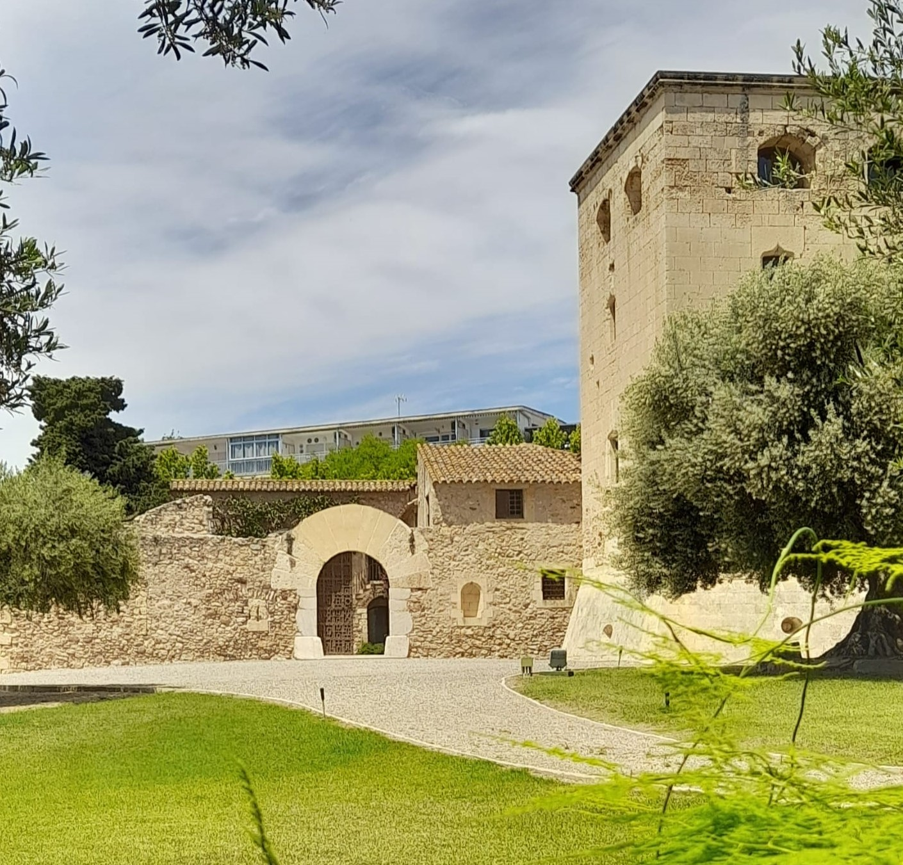
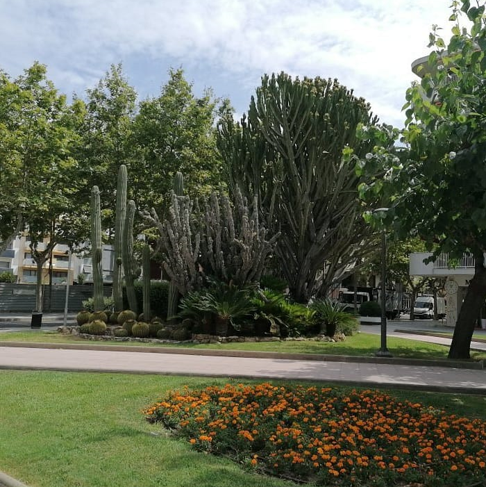
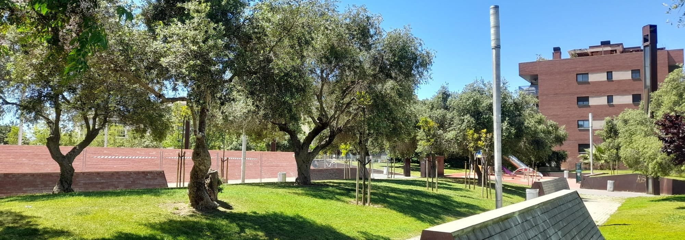
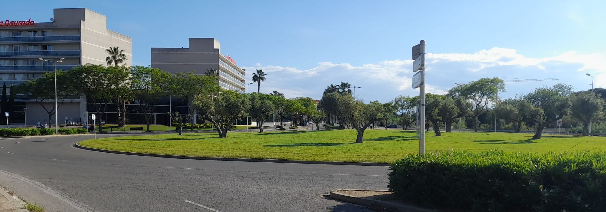
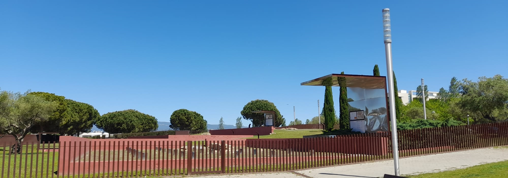

# Projecte PVS 🌳

El projecte d'investigació '**Pulmó Verd de Salou**' (PVS) s'ha dut a terme per posar èmfasi en la importància crítica de les zones verdes del municipi de Salou, reconeixent-les com a "pulmons" indispensables que nodreixen la vitalitat de la ciutat. Aquest esforç pretén examinar i defensar els espais verds del municipi com a components fonamentals per al benestar de la comunitat i la sostenibilitat ecològica. A més, el projecte implica avaluar l'estat actual d'aquests espais verds i abordar els seus reptes, amb l'objectiu de recomanar mesures per salvaguardar-los i potenciar-los per a la seva conservació a llarg termini.

## Dades/continguts ⚙️

En aquest apartat s'explica d'on han estat extretes les dades i les fotografies per a aquesta pàgina web.

### Dades 📋

Per tal de recollir les dades necessàries, s'ha utilitzat un estudi previ realitzat en el marc del Grau de Geografia, Anàlisi Territorial i Sostenibilitat. Aquest estudi va fer servir diferents fonts per recopilar la informació presentada. Aquestes fonts inclouen recursos oficials com la web de Turisme de Salou i les webs municipals de l'Ajuntament de Salou. Addicionalment, es va consultar una sèrie de fonts científiques i acadèmiques per donar suport teòric i científic als continguts presentats.

### Imatges 📸

Per garantir la legalitat i l'ús ètic de totes les imatges d'aquesta pàgina web, era imprescindible complir amb les normatives de drets d'autor i les llicències d'ús. Com a resultat, es va decidir utilitzar imatges exclusivament originals. Això inclou tant imatges per a aquest projecte com altres escollides específicament per a la pàgina web, que ofereixen una representació directa dels espais.

 

Altres imatges per incloses en la pàgina web han estat creades a partir d'intel·ligència artificial (IA), en aquest cas s'ha optat per utilitzar Microsoft Bing. Amb aquesta eina, i a través d'unes especificacions que se li han introduït, ha creat certes imatges per a l'apartat de l'equip de treball, generant diferents models d'investigadors per a un projecte com aquest.

 

## Estructura de la web 🧬

La pàgina està estructurada en cinc seccions clau:

1. Home: Aquesta secció proporciona una visió general del projecte, incloent-hi informació sobre els seus objectius i propòsits. S'hi pot trobar un resum del projecte i detalls rellevants sobre les seves intencions i metes.

1. Membres: En aquest apartat es presenten els diferents membres que han participat en el projecte. Aquesta inclou membres especialitzats en diversos àmbits permet oferir perspectives diverses per a una anàlisi completa del projecte.

1. Projectes: Aquí es detallen els diferents punts d'anàlisi i investigació que s'han dut a terme en el marc del projecte. Aquesta secció proporciona informació detallada sobre els processos de recerca i els resultats obtinguts.

1. Mapes: Aquest apartat mostra la localització dels diversos parcs i espais verds de la ciutat de Salou. Aquesta visualització cartogràfica pot ser útil per als usuaris interessats a conèixer més sobre els espais verds disponibles al municipi.

1. Contacte: Finalment, la secció de contacte permet als visitants de la pàgina web posar-se en contacte amb els investigadors o responsables del projecte. Això facilita la comunicació directa amb l'equip responsable i proporciona una via per a preguntes o col·laboracions futures.

## Web responsive 📱💻

Per aconseguir que la pàgina web sigui "responsive" (adaptativa) s'han utilitzat diverses tècniques.
Un dels mèotdes principals, utilitzant CSS, ha estat utilitzant regles "media queri" i "flexbox". Mitjançant "media query" en css, s'han establert regles i condicions que permeten redimensionar elements com imatges o contenidors en funció de la mida de la pantalla del dispositiu. Això garanteix que el disseny i la mida del contingut canviïn adequadament per adaptar-se a diferents resolucions de pantalla. Exemple:

**Reajustament dem mapa**. 
```css
/* Mapa */
#map { 
  width: 100%;
  height: 550px;
  box-shadow: 5px 5px 5px #888;
}

@media screen and (max-width: 768px) {
  #map {
    height: 400px;
    margin-bottom: -15px;
  }
  .text-font{
    margin-top: 0px;
  }
}
```
Pel que fa al "flexbox", és un model de disposició responsive de css que permet que els elements dins d'un contenidor es disposen automàticament segons la mida de la pantalla. Exemple:

**Reajustament flexbox d'un contenidor**. 
```css
/* Estils per als contenidors principals */
.container {
  padding: 64px;
  display: flex;
  flex-wrap: wrap;
}
```

Utilitzant els dos mètodes:

**Reajustament flex-items dels membres de l'equip**. 
```css
/* Estil dels Elements Flex */
.flex-item {
  padding: 10px;
  flex: 33%;
}

/* Disseny Responsiu 2 columnes */
@media (max-width: 1200px) {
  .flex-container {
    flex-direction: row;
  }
  .flex-item {
    flex: 50%; 
  }
}

/* Disseny Responsiu 1 columna */
@media (max-width: 800px) {
  .flex-item {
    flex: 100%;
  }
}
```
A més d'usar css, també s'ha usat javascript per editar l'adaptabilitat de la pàgina web en certs aspectes, com per exemple la barra del menú, la qual, en usar un dispositiu petit, aquesta provoca un canvi del menú, mostrant-se com un petit botó o icona que, quan es prem, expandeix el menú en lloc del menú de visualització de manera permanent, a diferència que en les pantalles grans.

## Parts rellevants ‼️

Així doncs, algunes parts rellevants d'aquesta pàgina web són:

**Barra de navegació**. Comuna per a tots els apartats d'aquesta web i on trobarem els diferents apartats (home, projectes, mapes, etc.) Aquesta barra és adaptativa (responsive), i es transforma en reduir la dimensió de la pantalla perquè aparega una icona d'un desplegable. Aquest és el codi html per a poder aconseguir això:
```html
  <a href="javascript:void(0);" class="icon" onclick="toggleResponsiveNavbar()">&#9776;</a>
```
Mentre, pel que fa al css, aquest s'encarrega d'aplicar certs estils quan la pantalla té una amplada màxima:
```css
@media screen and (max-width: 700px) {
   /* Ocultar enllaços, excepte el primer (el logotip) */
  .topnav a:not(:first-child) {
    display: none;
  }
  /* Mostrar l'icona del menú */
  .topnav a.icon {
    float: right;
    display: block;
  }
  /* Mode responsive */
  .topnav.responsive {
    position: relative;
  }
  .topnav.responsive .icon {
    position: absolute;
    right: 0;
    top: 0;
  }
  .topnav.responsive a {
    float: none;
    display: block;
    text-align: left;
  }
}
```
**Icona light/dark**. La icona que trobem al menú és la que ens permetrà canviar la tonalitat de la pàgina web, d'entre el mode clar (light) i el mode fosc (dark). Aquest efecte es crea a partir d'estils css, on es descriuen uns estils per a quan l'usuari interactuï amb aquesta icona. Quan l'usuari interactua amb aquesta són els estils js els que activen el css. Aquest js té quatre fases, la primera és la funció que detecta en quin mode es troba la pàgina i aplica estils de fons.
```js
function toggleDarkMode() {
  var element = document.body;
  element.classList.toggle("dark-mode");
  saveDarkMode();
  toggleDarkModeIcon();

  var navbar = document.getElementById("Controlbarra");
  var isResponsive = navbar.classList.contains("responsive");

  if (document.body.classList.contains("dark-mode")) {
    // Si estem en mode fosc, aplicar els estils foscos
    applyDarkModeStyles();
    navbar.style.backgroundColor = "#807f7f";
    navbar.style.color = "#aad6ec";
  } else {
    // Si estem en mode clar, aplicar els estils clars
    applyLightModeStyles();
    navbar.style.backgroundColor = "#ffffff";
    navbar.style.color = "#020202";
  }
}
```
Aquestes dues funcions gestionen l'aplicació "classList.add" o l'eliminació "classList.remove" dels estils de mode fosc i clar a la barra de navegació i altres elements.
```js
function applyDarkModeStyles() {
  var navLinks = document.querySelectorAll(".topnav");
  for (var i = 0; i < navLinks.length; i++) {
    navLinks[i].classList.add("dark-mode");
  }
  var icon = document.getElementById("toggleDarkModeIcon");
  icon.classList.remove("fa-moon");
  icon.classList.add("fa-sun");
}

function applyLightModeStyles() {
  var navLinks = document.querySelectorAll(".topnav");
  for (var i = 0; i < navLinks.length; i++) {
    navLinks[i].classList.remove("dark-mode");
  }
  var icon = document.getElementById("toggleDarkModeIcon");
  icon.classList.remove("fa-sun");
  icon.classList.add("fa-moon");
}
```
Aquesta funció desa l'estat actual del mode (clar o fosc) a l'emmagatzematge local del navegador.
```js
function saveDarkMode() {
  var mode = document.body.classList.contains("dark-mode") ? "dark" : "light";
  localStorage.setItem("mode", mode);
}
```
Aquesta funció carrega l'estat del mode des de l'emmagatzematge local i aplica els estils corresponents quan l'usuari visita una nova pàgina o actualitza la pàgina actual.
```js
function loadDarkMode() {
  var mode = localStorage.getItem("mode");
  if (mode === "dark") {
    document.body.classList.add("dark-mode");
  toggleDarkModeIcon();
  }
}
```
**Carrousel amb bootstrap**. A partir del framework Bootstrap 5 s'ha creat un carrusel d'imatges, permetent en visualitzar una sèrie d'elements. Primer de tot s'ha d'incloure els estils i els escripts necessaris:
```html
<link href="https://cdn.jsdelivr.net/npm/bootstrap@5.3.3/dist/css/bootstrap.min.css" rel="stylesheet">
<script src="https://cdn.jsdelivr.net/npm/bootstrap@5.3.3/dist/js/bootstrap.bundle.min.js"></script>
```
Pel que fa a l'estructura del Carrusel, aquest està contingut en un div, on trobem la imatge principal continguda en el div "carousel-item active", i les altres dues imatges en els divs "carousel-item". Trobem altra informació com la classe, la qual va enllaçada directament als estils inclosos anteriorment.
```html
<div class="carousel-inner">
  <div class="carousel-item active">
    
  </div>
  <div class="carousel-item">
    
  </div>
  <div class="carousel-item">
    
  </div>
</div>
```

## Cartografia 📌

La cartografia ha estat realitzada a partir del software QGIS. En aquest s'han digitalitzat els diferents parcs de la ciutat de Salou, en format punt, substituint aquest punt per una imatge SVG, la següent:


Posteriorment de la digitalització dels punts, s'ha utilitzat la capa del cadastre per a poder delimitar les àrees dels parcs i poder tenir polígons de les zones on es troben aquests espais. Aquestes es visualitzen en el mapa com a una capa de polígons de color verd.

Aquestes dues capes contenen la mateixa informació, compartida amb l'eina unir atributs per la localització, i conté informació com el nom del parc, l'àrea d'aquest, una qualificació, una descripció, i finalment, una imatge d'aquest. A la taula d'atributs d'aquestes capes es va incloure un apartat "popup" on, fent servir codi de programació s'han seleccionat les altres columnes per a unificar-se en una, i poder mostrar-ho tot en un mateix conjunt. Aquí un exemple:
```html
<strong>Plaça Andalucía</strong><br>
<strong>Àrea</strong><p>4.759m²</p>
<strong>Qualificació</strong><p>7/10</p>
<strong>Descripció</strong><p>La Plaça d'Andalusia de Salou és el cor de la vida urbana, amb una àmplia zona pavimentada envoltada de restaurants, bars i botigues. Amb una font central i àrees d'ombra, és un punt de trobada popular per a residents i visitants.</p>

```
A més a més, les capes de fons del mapa són QMS de ESRI, una imatge satèl·lit i un altre topogràfic.

Posteriorment a la creació del mapa, s'ha utilitzat el plugin QGIS2web per a poder exportar el mapa a un format web. Com a resultat vam obtenir una carpeta on trobaven diferents elements amb informació rellevant perquè el mapa pogués funcionar amb total normalitat, com css, js, data, etc. Aquesta informació s'ha extret de les carpetes corresponents i s'ha unificat amb el nostre codi perquè aquest estigues millor integrat amb la nostra web.

Una vegada fet això es va decidir editar algunes parts dels css que componen aquest mapa, per a poder modificar la presentació d'aquest mapa i ajustar-lo a les nostres necessitats. Una d'aquestes millores va ser la implementació d'un apartat responsive al leaflet.css perquè, quan la pantalla fos més petita, el pop-up s'ajustés a aquestes redimensionant-se.
```css
/* Media query para pantallas más pequeñas */
@media only screen and (max-width: 768px) {
    .leaflet-popup-content {
		max-width: 90%;
    margin: 10px;
    }
	.leaflet-popup-content p {
		margin: 5px 0;
		text-align: justify;
		font-size: 10px;
	}
	.leaflet-popup-content strong {
		font-size: 11px;
	}
	.leaflet-popup-content img {
		max-width: 50%;
		height: auto;
		display: block;
	}
}
```
Un altre canvi en l'arxiu css leaflet.css ha estat el color del pop-up, amb un color gris i amb una opacitat de 0.9.
```css
.leaflet-popup-tip {
	background: rgba(211, 211, 211, 0.9);
	color: #333;
	box-shadow: 0 3px 14px rgba(0,0,0,0.4);
	}
```
I també, al qgis2web.css, s'ha canviat el color del control superior que posa "Parcs de Salou" a una tonalitat verdosa amb una opacitat de 0.8.
```css
.leaflet-control{
  background-color: rgba(204, 255, 204, 0.8);
}
```

## Dificultats/millores 🛠️

Dificultats:
* La creació del mode light/dark ha estat un gran problema alhora de la creació de la pàgina web, ja que s'ha buscat que aquest és mantenir en els diferents apartats de la pàgina, provocant que aquest hagi de ser guardat en l'emmagatzematge local.
* L'implementació del missatge de les cookies, el qual permet informar els usuaris sobre l'ús d'aquestes, ha estat també un problema. Aquest s'havia d'emmagatzemar al dispositiu del usuari, per a que no tornes a sortir, obtant per guardar aquesta informació en local al navegador.
* Algunes dificultats en estructurar els diferents media queris per a ajustar-ho per a pantalles més petites.
* Dificultats en la lectura css dels codis generats per al mapa web, pel fet que no eren codis propis. Es va haver de realitzar una inspecció profunda per a poder entendre que realitzava cada cosa.

Millores:
* Les imatges proporcionades per la IA s'haurien de substituir per imatges de persones reals.
* S'hauria d'optimitzar la pàgina web, tant en diversos processos de js i css, que segurament es podrien reescriure i fer-los més compactes; com en optimització de les diverses imatges utilitzades.
* Es podrien millorar d'accessibilitat, com per exemple canvis de la mida de la lletra o inclús opcions de traducció del text a altres idiomes.

## Preguntes ❓


## Autor ✒️

* **Oriol Boronat Fernàndez** - *Treball inicial, documentació i pàgina web* - [oriolbf](https://github.com/oriolbf)

## Agraiments 🎁

* **Marc Martinez** - *Treball inicial i documentació*
* **Carlos Soriano** - *Professor de l'assignatura d'eines web* 
* **Benito Zaragozí** - *Professor de l'assignatura d'eines web* 
* **Jaume Marlès** - *Tècnic de jardineria i medi costaner de l'ajuntament de Salou* 
* **José Ignacio Muro** - *Professor de geografia humana a la Universitat Rovira i Virgili* 